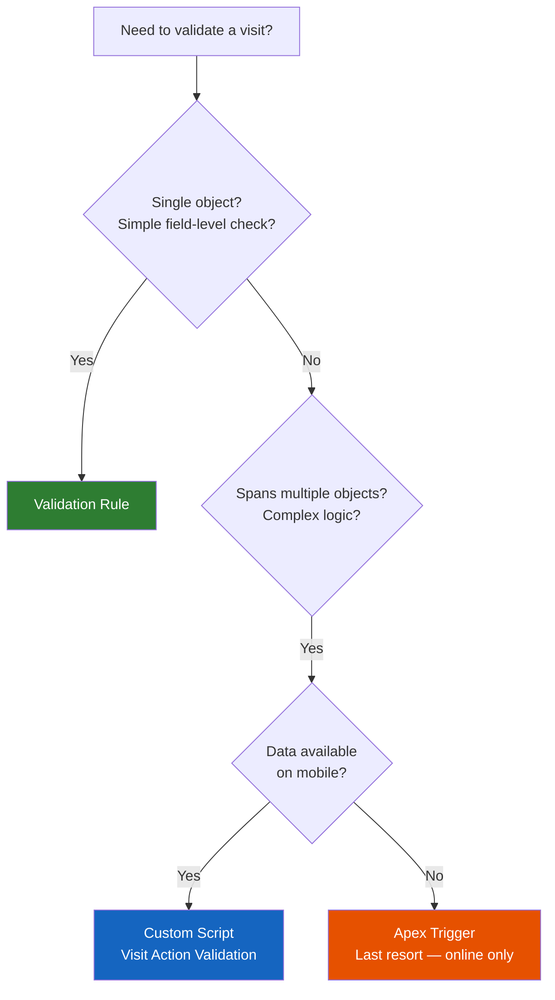
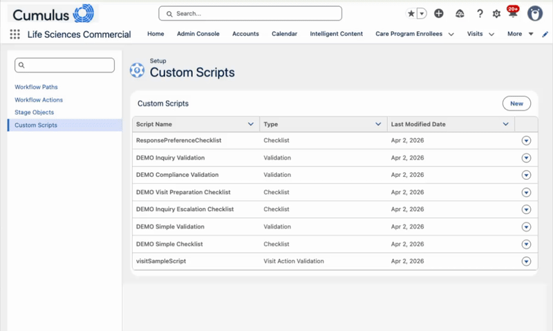

# Life Sciences Cloud - Custom Scripts Examples

<a href="https://githubsfdeploy.herokuapp.com?owner=afls-ideas&repo=lsc-custom-scripts-examples&ref=main">
  
</a>

A collection of small, focused example custom scripts for Life Sciences Cloud for Customer Engagement. Each example demonstrates one specific validation or checklist pattern that you can combine into your own scripts.

## Choosing a Validation Mechanism



| Mechanism | When to use | Online in web browser | Offline on iPad App |
|-----------|------------|--------|---------|
| **Validation Rule** | Simple, single-object checks that can be expressed with Salesforce's standard validation rule formulas | Yes | Yes |
| **Custom Script (Visit Action Validation)** | Complex validations spanning multiple objects (samples, details, attendees, etc.) | Yes | Yes |
| **Apex Trigger** | Last resort — when the validation requires data that is not available on the mobile device | Yes | No |

Start with validation rules whenever possible. They work both online and offline and require no code. Move to Custom Script Visit Action Validation when the logic spans multiple objects or needs conditional checks that validation rules can't express. Use Apex triggers only when the required data isn't synced to the mobile app — triggers fire server-side only, so they won't protect offline users.

## How Custom Scripts Work

Custom scripts are headless LWC components deployed to your org. The platform stores the JavaScript in the `CodeText` field of `LifeScienceCustomScript` records and executes it from there — not from the deployed LWC directly. After updating an LWC, you must click **Refresh** in Admin Console to sync the code. This copies the script to the `CodeText` field.



### Script Types

| Type | When it runs | How it's assigned |
|------|-------------|-------------------|
| **Validation** | Any workflow action (Record Update) | Assigned to Stage Objects |
| **Checklist** | User clicks info icon on Record Update actions | Assigned to Stage Objects |
| **Visit Action Validation** | User clicks Sign or Submit on a visit | Runs automatically (only one script runs — first by ID/creation date) |

### Important: Visit Action Validation

**Only one Visit Action Validation script runs per org.** If you create multiple scripts of this type, only the first one executes (based on ID or creation date). You must put all your validation rules in a single script and return multiple results in the array.

For Validation and Checklist scripts, you can assign different scripts to different Stage Objects.

## Required Record Fields

When creating `LifeScienceCustomScript` records:

| Field | Validation/Checklist | Visit Action Validation |
|-------|---------------------|------------------------|
| Name | Required | Required |
| ComponentName | LWC component name | LWC component name |
| Type | `Validation` or `Checklist` | `VisitActionValidation` |
| ObjectName | Not required | **`ProviderVisit`** (required!) |
| OperationEventType | Not required | **`OnUpdate`** (required!) |

Without `ObjectName` and `OperationEventType`, Visit Action Validation scripts silently don't execute.

For details on the context data JSON structure returned by `record.getContextData()`, see [CONTEXT_DATA_REFERENCE.md](CONTEXT_DATA_REFERENCE.md).

## Examples

Here is `visitVal02DetailAndSample` running as a Visit Action Validation — it requires both samples and detailed products before the visit can be submitted:


### Visit Action Validation — Pharma Domain Examples

While many of these examples could be achieved using simple validation rules directly on the object, they are provided here so you can combine multiple rules together into a single custom script. Since only one Visit Action Validation script runs per org, this is the recommended approach for real implementations.

11 deployable LWC components, each implementing one pharma-domain validation rule using the confirmed working IIFE pattern. Deploy any one as your org's Visit Action Validation script, or copy the validation function into a combined script.

#### Sync vs Async

- **Sync** — The validation only reads data already available in the visit context payload (`contextData`). Objects like `ProductDisbursement`, `ProviderVisitProdDetailing`, `ProviderVisit`, and `ChildVisit` are included in the context when the platform calls the script. No database query is needed, so the function runs synchronously.
- **Async** — The validation needs to look up related records that are **not** included in the context payload. For example, checking whether an Account is a Person Account (`IsPersonAccount`), looking up a product's brand from `Product2`, or querying territory assignments. These require `await db.query(...)`, making the function asynchronous.

As a rule of thumb: if the data you need is on the visit or its direct child records (samples, details, attendees, messages), it's in the context and you can use sync. If you need data from a related object like `Account`, `Product2`, `UserAdditionalInfo`, or `ObjectTerritory2Association`, you'll need an async `db.query`.

| # | LWC Component | Description | Objects Used | Sync/Async |
|---|--------------|-------------|-------------|------------|
| 01 | `visitVal01AtLeastOneSample` | Require at least one sample per visit | ProductDisbursement | Sync |
| 02 | `visitVal02DetailAndSample` | Require both samples and detailed products | ProductDisbursement, ProviderVisitProdDetailing | Sync |
| 03 | `visitVal03BrandExclusion` | Prevent detailing competing brands together | ProviderVisitProdDetailing (AdditionalInformation) | Sync |
| 04 | `visitVal04RequiredMessagePerDetail` | Require at least one detailed product with a key message | ProviderVisitProdDetailing, ProviderVisitDtlProductMsg | Sync |
| 05 | `visitVal05SampleDependency` | If product A sampled, product B must also be sampled ([demo](assets/visitVal05SampleDependency_Example.gif)) | ProductDisbursement, ProductItem, Product2 | Async |
| 06 | `visitVal06HcpRequiredForHco` | HCO visits require at least one HCP attendee | Account, ChildVisit | Async |
| 07 | `visitVal07SingleHcoAttendee` | Max one HCO attendee per visit | Account, ChildVisit | Async |
| 08 | `visitVal08MaxSamplesPerProduct` | Limit sample quantity per product per visit | ProductDisbursement | Sync |
| 09 | `visitVal09ChannelSpecific` | In-Person visits require detailed products | ProviderVisit, ProviderVisitProdDetailing | Sync |
| 10 | `visitVal10ProfileBasedMessage` | Field Sales Reps must deliver messages on In-Person visits | UserAdditionalInfo, ProviderVisitProdDetailing, ProviderVisitDtlProductMsg | Async |
| 11 | `visitVal11AccountCustomField` | Validate custom fields on the Account using `getCustomField()` helper | Account | Async |


### Workflow Validation

| Example | Description | Pattern |
|---------|-------------|---------|
| `inquiryValidationScript` | Validates inquiry questions, type, required fields | `db.query` + `ConditionBuilder` + `env.getOption` |
| `complianceValidationScript` | Compliance agreements, signatures, adverse events | `AndCondition` + status transition checks |
| `simpleValidationExample` | Starter template | Minimal boilerplate |

### Checklists

| Example | Description | Pattern |
|---------|-------------|---------|
| `visitPreparationChecklist` | Visit preparation steps | Mixed sync/async |
| `inquiryEscalationChecklist` | Inquiry escalation steps | User profile queries |
| `simpleChecklistExample` | Starter template | Minimal boilerplate |

## Project Structure

```
force-app/main/default/lwc/
├── visitSampleScript/            # Visit Action Validation - sample & detail checks
├── visitActionValidation/        # Visit Action Validation - minimal template
├── visitVal01AtLeastOneSample/   # through
├── visitVal11AccountCustomField/  # 11 pharma-domain validation LWCs
├── inquiryValidationScript/      # Validation - medical inquiry workflow
├── complianceValidationScript/   # Validation - compliance & adverse events
├── visitPreparationChecklist/    # Checklist - visit preparation steps
├── inquiryEscalationChecklist/   # Checklist - inquiry escalation steps
├── simpleValidationExample/      # Starter template - validation
└── simpleChecklistExample/       # Starter template - checklist

```

## Quick Start

### Deploy

```bash
# Clone the repository
git clone <repo-url>
cd Custom_Scripts

# Deploy all LWC components
sf project deploy start --source-dir force-app

# Register custom scripts (creates LifeScienceCustomScript records)
sf data import tree --files data/LifeScienceCustomScripts.json --target-org <your-org>
```

### After Deploy

1. **Admin Console** > **Workflow Configuration** > **Custom Scripts** > click **Refresh** on each row
2. For Visit Action Validation: set `ObjectName=ProviderVisit` and `OperationEventType=OnUpdate` on the record
3. For Validation/Checklist: assign scripts to Stage Objects via **Workflow Configuration** > **Stage Objects** > **Edit**

### Sharing

The `LifeScienceCustomScript` object defaults to Private sharing. Rep users need record-level access to see custom script records. Change OWD to **Public Read Only** in Setup > Sharing Settings if reps can't see scripts.

## Output Format

```javascript
{
    title: string,   // Message displayed to the user
    status: string   // "success", "warning", or "error"
}
```

| Status | Checklist | Validation |
|--------|-----------|------------|
| `success` | Green check | Not displayed |
| `warning` | Yellow alert | Shows warning dialog, user can continue |
| `error` | Red X | Blocks action, shows error dialog |

## Available Globals

| Global | Description | Key Methods |
|--------|-------------|-------------|
| `record` | Current record | `stringValue(field)`, `boolValue(field)`, `getContextData()` |
| `user` | Current user | `stringValue(field)` |
| `db` | Database access | `query(entity, conditions, fields)` |
| `env` | Environment | `getOption(key)`, `log(message)` |

## Available Classes

`ConditionBuilder`, `FieldCondition`, `SetCondition`, `AndCondition`, `OrCondition`, `GroupCondition`, `DateFieldCondition`, `DateTimeFieldCondition`

## Gotchas

- **CodeText is the runtime source of truth.** The platform executes from the `CodeText` field, not the deployed LWC. Always click Refresh after deploying.
- **CodeText is read-only via API.** You cannot update it programmatically — only through the Refresh button.
- **No comment blocks before the IIFE.** JSDoc or multi-line comment blocks (`/** ... */`) before the opening `(() => {` cause Locker Service to silently fail — the platform shows a generic error with zero console output. Put comments inside the IIFE if needed.
- **Large scripts crash silently.** If a script is too large, Locker Service fails to evaluate it and the platform shows a generic error with no console output. Keep scripts small and focused.
- **Proxy wrapping.** Return values get wrapped in Locker Service Proxy objects. The platform's `translateValidationResults` cannot read Proxy-wrapped results. **You must call `unwrapProxy(results)`** (i.e., `JSON.parse(JSON.stringify(results))`) before returning from `validateVisit()`. Without this, the platform silently allows the visit through.
- **Only one Visit Action Validation runs.** First by ID/creation date. Put all rules in one script.
- **ObjectName and OperationEventType required.** Without these on the LifeScienceCustomScript record, Visit Action Validation scripts silently don't execute.
- **Custom fields (`__c`) require different access methods.** `stringValue()` does not work for custom fields on either platform. On web, use `.sObject.Field__c`. On iPad, use `noNs_stringValue('Field__c')`. See [CONTEXT_DATA_REFERENCE.md](CONTEXT_DATA_REFERENCE.md) for a cross-platform helper.
- **Null custom fields are silently dropped.** On web, `db.query` results omit custom fields with null values from the `sObject` — they return `undefined`, not `null`.
- **iPad custom fields require DB Schema configuration.** Custom fields must be included in the mobile metadata cache (Admin Console > Mobile > Object Metadata Cache Configuration). Regenerate the cache and re-login after adding fields.

## Testing

```bash
npm install
npm test
```

Tests use `new Function('env', 'record', 'db', 'ConditionBuilder', 'FieldCondition', ...)` to load scripts and mock globals. See `__tests__/` directories for examples.

## Workflow Paths

These examples work with the following workflow paths (configure in Admin Console > Workflow Configuration > Workflow Paths):

| Object | Controlling Field | Record Type |
|--------|------------------|-------------|
| Inquiry | Status | (default) |
| ProviderVisit | Status | (default) |

## Resources

- [Custom Scripts for Life Sciences](https://help.salesforce.com/s/articleView?id=sf.ls_custom_scripts.htm&type=5) - Salesforce Help
- [LSStarterConfig](https://github.com/SalesforceLabs/LSStarterConfig) - Salesforce Labs starter config
- [Administering Life Sciences Cloud](https://help.salesforce.com/s/products/health?language=en_US)

## License

Example code for educational purposes. Use as reference implementations for building custom scripts in your Life Sciences Cloud org.
